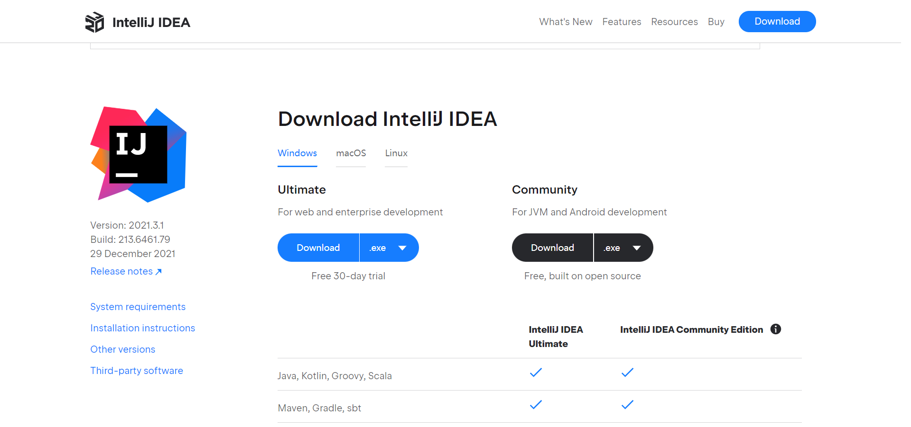

# IDEA的安装

* * *

## 一、下载安装

我的电脑是Windows10 64位的，下载安装的是Ultimate版本的，只有一个月的试用期。Ultimate版本的功能更多，但是对于简单的Java开发使用Community版本就够用了。Community：社区版，免费，但是功能有限制，Android Studio就是基于这个版本定制的。Ultimate：Ultimate英文翻译就是终极版，收费，功能无限制。
官网下载:[下载地址](https://www.jetbrains.com/idea/download/#section=windows)

## 二、点击安装包安装

直接运行exe文件点击**next**勾选版本如图所示，之后点击**next**

安装完成点击**finsh**如图，安装成功。

## 三、激活教程

相关文章：[地址链接](https://www.exception.site/essay/how-to-free-use-intellij-idea-2019-3)

激活补丁：[链接](https://pan.baidu.com/s/1n6vr7u9cNT7JblDJwkIAGg)
提取码：cyos --来自百度网盘超级会员V1的分享

## 相关配置

