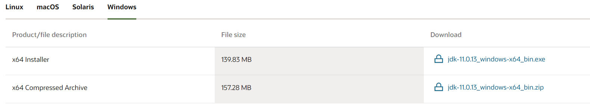

# Java配置方法  

1.下载Java  
    这里我下载的是Java11
    下载地址：[Java11](https://www.oracle.com/java/technologies/downloads/#java11-windows)

  
2. 安装Java11  
  
3. 配置Java环境  
    方法1：选中我的电脑 --> 键盘按下 Alt + Enter --> 高级系统设置 --> 环境变量  
    方法2：键盘按下 win + r --> 输入 sysdm.cpl --> 高级 --> 环境变量  
    方法3：win10系统下，工具栏有搜索图标，点击后直接搜索"环境变量"  
    F:\Program Files\Java  
4. 配置用户变量  
变量名：JAVA_HOME 变量值：F:\Program Files\Java  
变量名：CLASSPATH 变量值：;%JAVA_HOME%\lib;%JAVA_HOME%\lib\tools.jar;  
变量名：Path 变量值：%JAVA_HOME%\bin，%JAVA_HOME%\jre\bin  
5. 验证试运行  
  

## 配置Vscode  

1. 点击扩展(Ctrl+Shift+X) --> 搜索查找 Java Extension Pack --> 点击安装  
如果你已安装的Java版本 是 Java 11，直接跳过；如果你安装的是Java 8，那么先别安装上面的插件。（已安装的就删了吧~~~）  
java8安装  
Ⅰ、在上面搜索Java Extension Pack的界面上，点击安装 【Language Support for Java(TM) by Red Hat】。  
Ⅱ、安装后回到Java Extension Pack的界面。
Ⅲ、安装【Java Extension Pack】
2. 设置java路径
打开vscode设置（Ctrl + ，） -->  搜索设置输入 javahome -->  点击 Java: Home下的在settings.json中编辑，
第①行是JAVA_HOME的路径，记得把 "\" 改成 "\\"  
