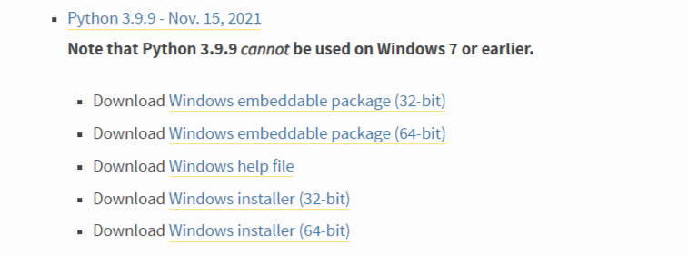
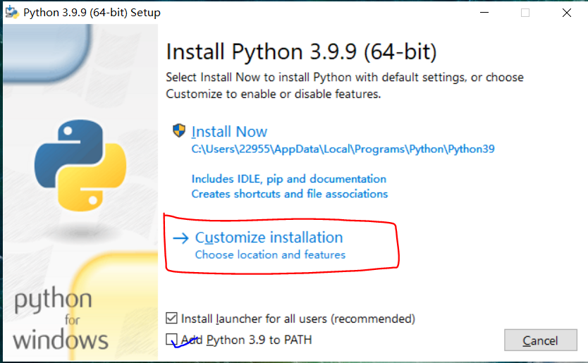

# Python安装教程

步骤1. Python[官网下载](https://www.python.org/downloads/windows/)
embeddable zip file 是压缩包版本，即便携版，解压可用
executable installer 是可执行的安装版本，即离线版，下载到本地后可以直接安装  

步骤2. 直接运行点击安装，记着勾选**Add Python 3.9 to PATH**

步骤3. 测试运行  

之后就安装成功！

## Python 在Vscode中使用  

***
1. 安装Python插件，在 VSCode 中搜索扩展 Python  
